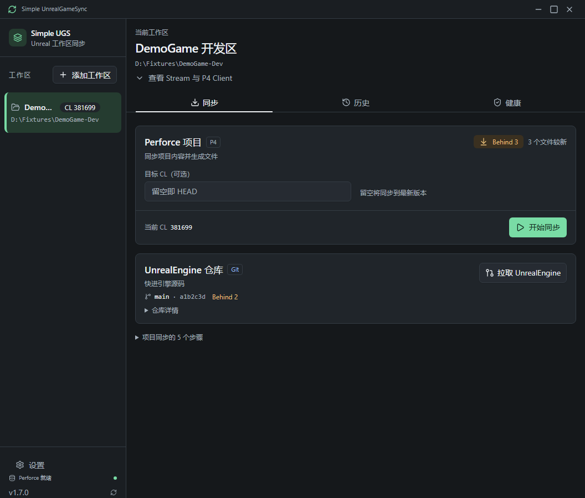
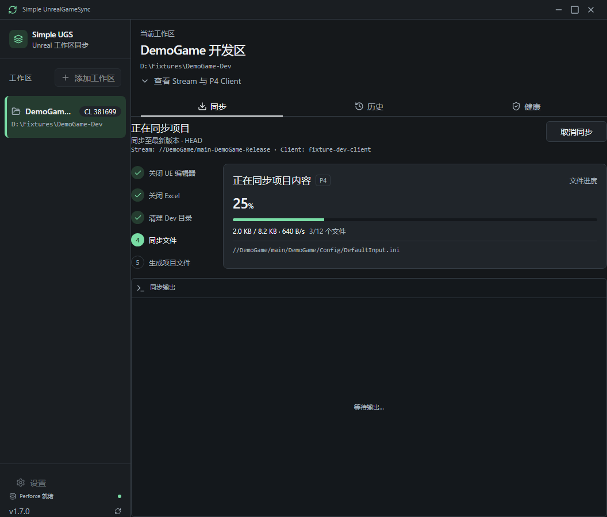

# Simple UnrealGameSync

A lightweight desktop GUI for running Perforce syncs on source-build Unreal
Engine game projects on Windows. It replaces hand-rolled PowerShell scripts with
a real interface: live sync progress, multi-workspace management, and one-click
rollback to a previous changelist.

Inspired by Epic's UnrealGameSync (UGS), but intentionally small and focused —
just the sync workflow, no Swarm/metadata server required.

<p align="center">
  
</p>
<p align="center">
  
</p>

## Features

Screenshots show fictional DemoGame workspaces and generated test data.

- **One-click sync** — closes the running UE editor, cleans the `Content/Developers`
  directory, runs `p4 sync`, and regenerates project files in a single flow.
- **Live progress** — streams `p4 sync` output line-by-line with a byte-level
  progress bar (virtualized log view handles large syncs without lag).
- **Multi-workspace** — register several P4 workspaces and switch between them;
  the project subdirectory name is configurable per workspace.
- **Sync history & rollback** — records each sync (changelist, time, file count)
  and can roll a workspace back to an earlier changelist.
- **Configurable exclusions** — skip directories like `Binaries`,
  `Content/Developers`, or anything else, relative to your project directory.
- **Idle behind-check** — periodically runs a dry-run `p4 sync -n` to show how
  many files you are behind.
- **System tray** — minimizes to tray and reflects sync state in the tooltip.
- **Git pull for the engine** — pulls the `UnrealEngine/` Git working copy.
- **Bilingual UI (中文 / English)** — every string, tray notification included,
  switches instantly; follows the Windows display language on first launch.
- **Dark & light themes** — follows the system color scheme, with a responsive
  layout that stays usable down to a 352px-wide window (compact sidebar).

## Limitations

- **Submitting Perforce changelists is not supported yet.** The app can sync, roll back, and git-pull the engine; it does not `p4 submit`. Check in pending work with P4V or the `p4` CLI.

## Prerequisites

Before publishing a source copy, run `npm run check:privacy`. It checks tracked
and nonignored new files, including documentation images. Keep private keys,
settings and planning files outside the submission; `.gitignore` is not a backup.
Image changes need visual review and an explicit hash update in
`scripts/guards/reviewed-images.json`. The check has no automatic approval mode.

- **Windows** (the tool targets the Windows UE development environment).
- **Perforce command-line client (`p4`)** installed and on your `PATH`.
- A workspace laid out as a source-build UE project:
  ```
  <root>/
    <YourGame>/                 # your game project directory (configurable name)
      Content/, Binaries/, ...
    UnrealEngine/
      GenerateProjectFiles.bat
      Engine/
  ```
  The game directory may sit at `<root>/<YourGame>` or
  `<root>/UnrealEngine/<YourGame>` — both layouts are detected.

## Installation

Download the latest `*-setup.exe` from the
[Releases](https://github.com/YangZhou91/simple-unrealgamesync/releases) page and run it.

## Usage

1. Launch the app and click **+** to add a workspace.
2. Fill in **Name**, **Root Path** (the workspace root), **Project Directory**
   (your game's subdirectory name, e.g. `MyGame`), **P4 Client**, and **P4 User**.
3. (Optional) Open **Settings** to adjust excluded paths, parallel sync threads,
   and the idle behind-check interval.
4. Click **Start Sync**. To sync to a specific changelist, enter it in the
   **Target CL** field first; leave it empty to sync to HEAD.
5. Use the **History** tab to review past syncs or roll back to an earlier
   changelist.

## Build from source

Requirements: [Rust](https://rustup.rs/) (1.82+), [Node.js](https://nodejs.org/) (18+).

```bash
git clone https://github.com/YangZhou91/simple-unrealgamesync.git
cd simple-unrealgamesync
npm install

# Run in development
npm run tauri dev

# Produce a release installer (NSIS .exe under src-tauri/target/release/bundle/)
npm run tauri build
```

Run the tests:

```bash
npm run build && npx vitest run     # frontend
cd src-tauri && cargo test          # backend
```

## Tech stack

Tauri 2 (Rust backend) + React 19 + TypeScript + Vite + Tailwind CSS, with
`tokio` driving async process orchestration for the `p4` CLI.

## License

[MIT](LICENSE) © 2026 YangZhou91
